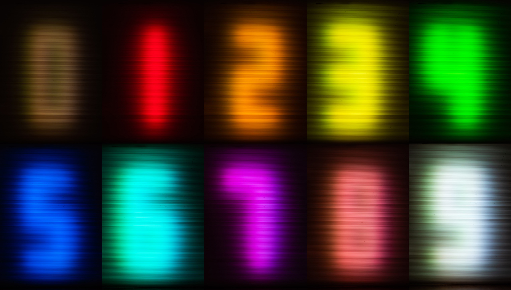
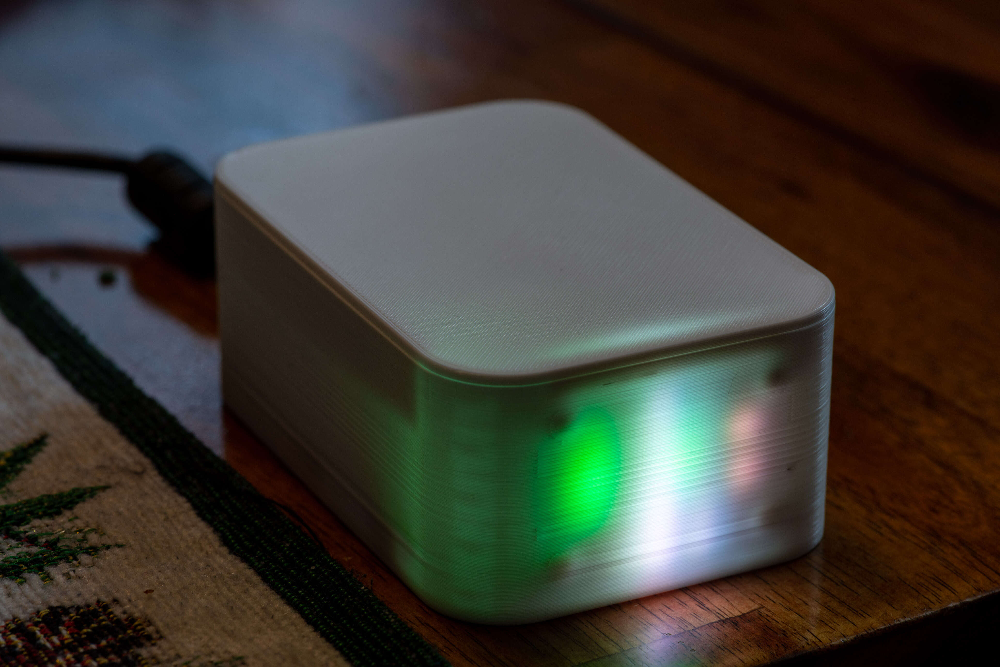

# matrix_clock
> "I DON’T EVEN SEE THE CODE ANYMORE" - The Matrix.  


Shown above is a clock that presents in a matrix-like format on an 8x8 RGB LED matrix.  It's not readable to a passer-by but one can learn to read it with practice.

Here I explain how to build the clock above.  I also explain how to modify it in different ways.  For example maybe you want:

   * To use a different LED matrix (Different dimensions, neopixel, other types)
   * To use a different type of clock hardware (Radio based, GPS, internet, none)
   * To display the data differently (Scrolling numbers, binary clock etc).

This project attempts to make it straight-forward to make changes like the ones
described above, both in the way the code is structured and in the advice I give
later in this document.

# Parts List

Here are the parts I used to build the pictured version:

   * Microcontroller: Raspberry PI Pico
   * LED Matrix: Adafruit Dotstart 8x8
   * Clock: DS3231-based RTC module
   * Buttons: 2 12x12 pushbuttons for control, 1 6x3 SMD reset button (optional)
   * Connector: 1 4x1 JST-XR male-female pair for connecting the LED matrix
   * 1 220uF capacitor to reduce 5V noise
   * A 6x4 cm copper clad board. Only needed if you CNC or chemical etch your PCB.

# Reading the clock

Here is my scheme for showing the time, which you can easily modify to your preference.

Numbers are represented by colors.  At the time of writing, they are as follows:




> Colors are defined in [src/colors.c](src/colors.c) if you would like to edit them.

As for the individual digits in the time, these are represented by the speed at
which the matrix points fall:

| digit               | speed  |
|---------------------|--------|
| Hour - ones place   | slow   |
| Minute - tens place | medium |
| Minute - ones place | fast   |

So given the above, here is a table of examples:

| 12h time | 24h time | Slow point | Medium Point | Fast Point |
|----------|----------|------------|--------------|------------|
| 12:00 AM | 00:00    | brown      | brown        | brown      |
| 12:15 AM | 00:15    | brown      | red          | blue       |
| 1:37 PM  | 13:37    | yellow     | yellow       | magenta    |
| 11:37 PM | 23:37    | yellow     | yellow       | magenta    |


If you are wondering about the hour's tens place, the clock doesn't show it.  I thought it made the clock easier to read but you'll have
to know if it's morning our evening to fill in the tens yourself.

Note that the clock has other easier-to-read modes that show actual numbers,  More on that later.

# Feature Overview

This is a quick tour of the built in-features

## Power On

When you first plug in the board you will get a matrix clock display that indicates the current time as-reported by the connected clock module.



## Setting the Time

The clock has two buttons: "set" and "increment".

   * If you press the set button once, the clock will show the current hours as numbers.  You can use the "increment" button to change the hour.
   * If you press the set button again, the clock will show the current minutes.  You can use the "increment" button to change the minute.
   * If you press the set button a third time, the clock will return to showing the matrix display

## Changing the Display Mode

If you press the "increment" button while the matrix is showing, the clock will
cycle through display modes.  Currently defined modes include:

* **Matrix** (the default)
* **Time scroll**, similar to matrix mode but uses numbers so it's easier to read
* **Time fade**.  Uses bigger numbers so even easier to read
* **Binary digits**.  Uses binary symbols in place of digits. Unfortunately my plastic case diffuses the pixels too much for this mode to work well, but it could work well with alternate case designs.
* **Off**.  Useful if you want a darkened room.

## Console Configuration

If you plug the clock into a computer, you can run a terminal emulator program to access additional settings.  In Linux, I use the "minicom" terminal emulator and my command looks like this:

```bash
minicom -b 115200 -P /dev/ttyUSB0
```

The serial device (`/dev/ttyUSB0`) can vary between computers and operating systems. 

Once started, youi will see something like this:


By default, `minicom` turns on local echo, making my typed character appear twice.
`minicom` allows this to be turned off with `ctrl-a e`.

Type `help` or `?` for help.  Basic options include:

   * Changing LED brightness
   * Changing the time
   * Setting a sleep/wake time where the clock LEDs will automatically turn off.

# Build Instructions

## Electronics

## Firmware

# Cusomization Guide

## Using Different LED Hardware

## Using Different Clock Hardware

## Changing The Display Rendering

## Changing the Console

## Using a Different Microcontroller

