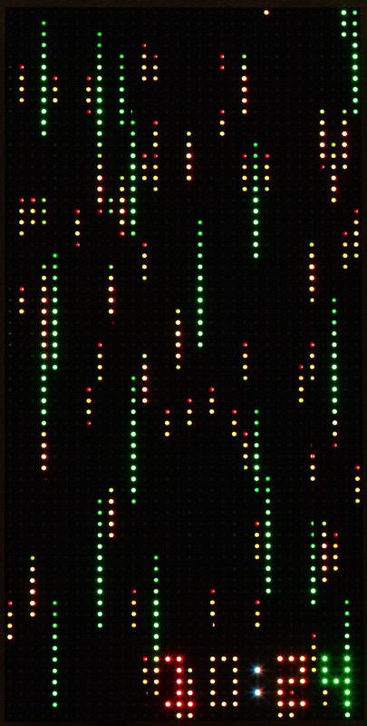
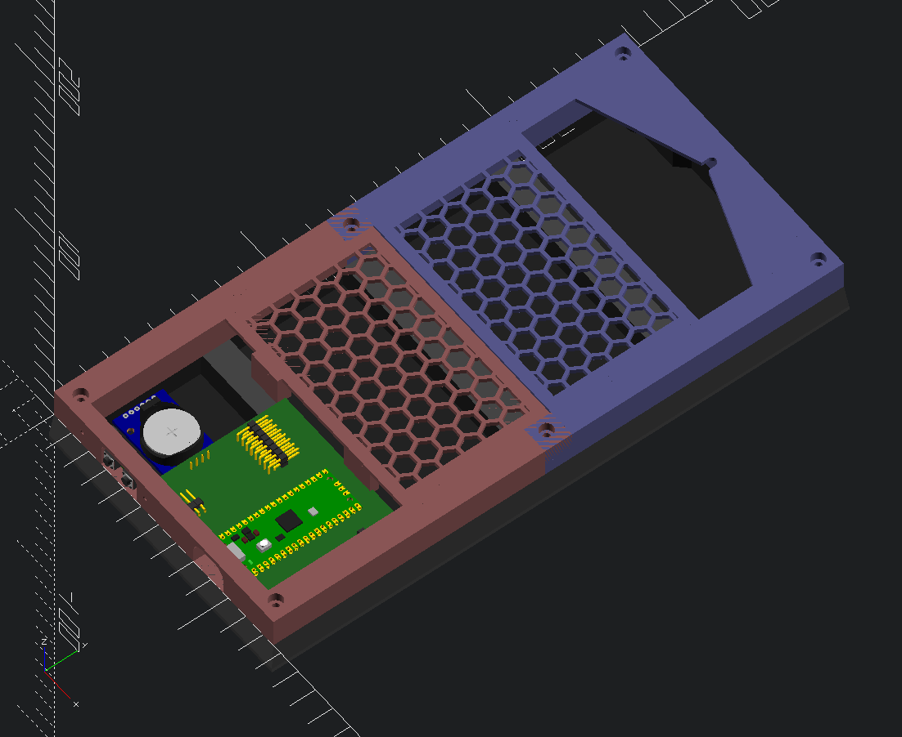

# matrix_clock
> "I DON’T EVEN SEE THE CODE ANYMORE" - The Matrix.  


Shown above is a clock that presents the current time on an 64x32 RGB LED
matrix.  The clock has other selectable modes, including a view that omits the numbers:


and some other selectable views:


Although the images above give you a basic idea, they can't show you the
dynamic range of the LED or the graphical effect of the 200 FPS animations,
I guess you'll just have to build one to see it yourself.

In terms of hardware the project's firmware is setup to support other hardware
configurations.  Included is a 8x8 dotstar matrix version that was my "V1":


This document focuses on the newer 62x32-based model, which I prefer.  If you
want to learn more details on the 8x8 build, I have a separate document
for it [here](README_dotstar_8x8.md).

In the upcoming sections, I explain how I built the clock.  I also
explain how to modify the design in different ways.

# Parts List

Here are the parts I used.  You can of course modify the design to use
different ones.  Prices are "at time of writing":

   * Microcontroller: [Raspberry PI Pico ($4)](https://www.adafruit.com/product/4864)
   * [LED Matrix 62x32: ($30)](https://www.amazon.com/waveshare-Displaying-Animation-Adjustable-Brightness/dp/B0B3W1PFY6)
     Note there are many variants available.
   * Clock: [DS3231-based RTC module ($4)](https://www.amazon.com/HiLetgo-AT24C32-Arduino-Without-Battery/dp/B00LX3V7F0)
   * Buttons: [2 12x12 pushbuttons for control (<$1)](https://www.amazon.com/WOWOONE-12x12x7-3-Tactile-Momentary-Assortment/dp/B08JLWTQ3C),
     1 6x3 SMD reset button (optional)
   * Connectors:
     * One 8x2 2.54 pitch male pin header to interface the Pico PCB with the
       matrix (using the usually-included interface cable)
     * A couple of angled male pin headers to connect to buttons and power.
   * 1 100uF capacitor to reduce 5V noise.  Somewhat larger or smaller values
     values should also work fine.
   * PCB for assembly.
     * Many options.  Below is what I went with.
     * I ended up ordering a PCB from http://oshpark.com for the main board
       becuase it is a two-layer board with many connections - doable on
       a perf board but somewhat laborious and tricky to make a clean result.
     * There is a separate PCB for the buttons.  This board is very simple so
       any build technique should be straight-forward.  I used my CNC
       machine to get the hardware quickly. 

Optional:

The LED display as-designed is powered directly from the Pico USB power pin
(VDD).  This reduces part count and complexity.  The downside is that the LED
hardware can pull a lot of current if every pixel is set to white (around 3A).
The firmware included never does this and thus pulls between 100-400 MA
(measured).  The optional part is a current protection IC (the NCP380)
which will limit the max current to the LED to 500 mA, protecting the Pico
and potentially the USB power source from sourcing excessive current.  In my opinion
this is important if you are experimenting with your own custom firmware
modifications.  If you are just sticking with the stock ones, I have already
checked that the current draw is not excessive and you can skip the
protection hardware and save a bit of money.  Here are the needed parts:

   * NCP380
   * Two additional 1uf capacitors for stability.  I am using SMD but ceramic
     through-hole are also an option.

# Reading the clock

Here is my scheme for showing the time, which you can easily modify to your
preference.

Numbers are represented by colors.  At the time of writing, they are as follows:


> Colors are defined in [src/colors.c](src/colors.c) if you would like to edit them.

As for the individual digits in the time, these are represented by the speed at
which the matrix points fall:

| digit               | speed  |
|---------------------|--------|
| Hour - ones place   | slow   |
| Minute - tens place | medium |
| Minute - ones place | fast   |

Here are some examples:

| 12h time | 24h time | Slow point | Medium Point | Fast Point |
|----------|----------|------------|--------------|------------|
| 12:00 AM | 00:00    | brown      | brown        | brown      |
| 12:15 AM | 00:15    | brown      | red          | blue       |
| 1:37 PM  | 13:37    | yellow     | yellow       | magenta    |
| 11:37 PM | 23:37    | yellow     | yellow       | magenta    |

The falling points do not show the tens place of the hour becuase I thought it
made the clock harder to read.  Also there are not many options in the tens
place (0, 1 or 2).  If you want the tens place, you can select one of the
available display modes that shows it.

# Feature Overview

This is a quick tour of the built in-features

## Power On

When you plug in the clock via any USB power source you will get a matrix clock
display that indicates the current time as-reported by the RTC clock hardware.



## Setting the Time

The clock has two buttons on it's side: "set" and "increment". Pressing "set"
goes into time change mode where you can use "set" and "increment" to change
each time digit.

> You can also set the clock via the USB connection.

## Changing the Display Mode

If you press the "increment" button while the matrix is showing, the clock will
cycle through display modes.  Currently defined modes include:

* **Matrix With Numbers** The default
* **Matrix Only** For those who want a challenge
* **Number Cascade**, Numbers fall instead of points with hours being "closer"
  (larger/faster) than minutes.
* **Off -**  Useful if you want a darkened room.

## Console Configuration

If you plug the clock into a computer, you can run a terminal emulator program
to access additional settings.  In Linux, I use the "minicom" terminal emulator
and my command looks like this:

```bash
minicom -b 115200 -P /dev/ttyUSB0
```

> The serial device (`/dev/ttyUSB0`) can vary between computers and operating
> systems. 

Once started, you will see something like this:


> By default, `minicom` turns on local echo, making my typed characters appear
> twice.  `minicom` allows this to be turned off with `ctrl-a e`.

Type `help` or `?` for help.  Basic options include:

   * Changing LED brightness
   * Changing the time
   * Changing the poweron display mode
   * Simulating hardware button presses
   * Setting a sleep/wake time where the clock LEDs will automatically turn off.

# Build Instructions

## Electronics

Here is the schematic for the 64x32 (rotated) version:


Here is a description on major components and their purpose:

  - Pi Pico: This is the main controller
  - RTC Clock: This provides time to the Pico via an I2C connection.  You
    could use other solutions here, including attempting to use the PI Pico itself
    to track time but also GPS, radio-based time, or internet time using a
    Pico W.  PI Pico internal and RTC alrady have code, everythig else will
    require code to be written.  In terms of the I2C connection, note that the
    RTC clock is powered by 3.3V instead of the specified 5V.  This is the
    easiest way to make the clock compatible with the 3.3V maximum voltage of
    the PI Pico.  If your RTC really does need 5V, there are solutions but the
    details are not the focus of this document.  Thus I suggest doing a Google
    search for "3.3 to 5V I2C" to learn more.
  - 64x32 matrix: This is also a 5V part but can usually be
    controlled from the 3.3V outputs of the PI Pico, even though the LED is
    being *powered* by 5V - mine works properly in this configuration. All
    connections are high-impedance passive inputs so the Pico does not have to
    concern itself with the 5V nature of the LED panel.  An easy way to tell is
    to see if any reviews are running the panel directly from a 3.3V part, such
    as the PI Pico, Raspberry PI, ARM, or ESP series.  If you have an LED matrix
    that ignores 3.3V, the problem can be solved by adding "level shifter" ICs or
    an equivilent circuit.
  - 100u capacitor.  The actual value is not important other that "big".  The
    purpose of the capacitor is to support the power requirements of the LED, which
    can be a "noisy" load, needing near zero current one moment and several hundred
    mA the next.
  - Support for buttons.  Select, increment and reset as described earlier.
  - NCP380 current limiting chip (optional).  This chip provides insurance for
    the case where you one day decide to change the firmware to light up many
    LEDs and draw too much current.  If you really want to do support high
    current draw, you'll need to rework the power design so that the LED panel
    can be directly powered from a capable (3A+) source instead of VDD on the
    Pico.
    
> VDD on the Pico is a direct passthrough to the USB power so it's the
> USB regulator (wall adapter, computer) and the PCB traces of the Pico that are
> the main power bottlenecks.

> If you don't us use the NCP380, simply connect the 5V directly to the LED.
> Keep the 100u capacitor for noise purposes.

## Firmware

> TLDR: If you don't want to build the firmware (`matrix_clock_led_64x32.uf2`) 
yourself, I have a couple of precompiled versions under the
[firmware](firmware) directory.

Source files (written in C) are  provided in the [src/](src) directory.  If you
have never built PI Pico firmware before, run through the official [Getting
started with the Raspberry Pi
PICO](https://datasheets.raspberrypi.com/pico/getting-started-with-pico.pdf)
documentation first to get the needed tools up-and-running on your system.

The instructions for building the clock firmware are the same as the guide
linked above, but I created a small/simple [bootstrap.sh](src/bootstrap.sh)
script to lessen the number to needed steps:

```bash
./bootstrap.sh 
cd build/
make -j
```

I encourage you to view the contents of [bootstrap.sh](src/bootstrap.sh)
  yourself instead of blindly running it.  You'll see something like this:

```bash
$ cat bootstrap.sh 
#!/bin/bash

if [ ! -f pico_uart_console/CMakeLists.txt ]; then
  git submodule init
  git submodule update
fi

rm -rf build
mkdir build
cd build
cmake ..
```

The two major things done here are getting some dependencies (submodules) and
setting up a new build environment under `build/`

If all went well above, you will have a `src/build/matrix_clock.uf2` file available
to load onto a PI Pico.  Note that `firmware/matrix_clock_led_64x32.uf2` will
not be changed.

# Hardware build

The hardware build is fairly minimalistic, solving the given problems:

  * Securing the PI Pico, RTC hardware and buttons at the bottom of the panel
  * Keeping the connection cables constrained so the clock can mount flat on the way
  * Providing a wall mount

I solved all of these problem by creating a couple of 3D models and printing them out.
I used OpenSCAD for the modeling.  Here is an image of the model:

This model is located at [case/led_matrix_64x32/led_matrix_64x32.scad](case/led_matrix_64x32/led_matrix_64x32.scad).
If can be changed with any text editor and viewed in the free [OpenSCAD](http://openscad.org) software.

If you don't want to mess around with OpenSCAD, I also have the models available for
direct download at [case/led_matrix_64x32/export](case/led_matrix_64x32/export).  These
are .3mf files (an improved .stl) that most modern slicer programs can directly load.




To assemble, you use M2 bolts to attach the buttons to the bottom, I think I used 6mm but something in that area should be fine.  Use M3 bolts (around 12-16mm) to attach the 3D printed parts to the led matrix.  The PCB fits into a custom slot in
the bottom 3d part (see the grooves in the red image above) and is held in place with no bolts required, just make sure it's
in position before tightening the bolts.

The hex matrixes on the back hold the power and led interface cables within the unit so that it will mount flush on
the wall.  A guide and socket is provided for wall hanging the unit.


# Cusomization Guide

This part of the documentation points you in the right direction if you want to modify the project.

## Using Different LED Hardware

The file [src/led_matrix.h](src/led_matrix.h), contains the interface your
hardware driver will be called with.
[src/led_matrix_62x32.c](src/led_matrix_64x32.c) implements it for the 8x8 64x32
led case.  There is also a [src/led_matrix_dotstar.c](src/led_matrix_dotstar.c) file
which is used *instead* when building the dotstar version.
To use your own, create a new `.c` file (such as `src/led_matrix_neopixel.c` and
change `CMakeLists.txt` to point to your new file instead of
`led_matrix_dotstar.c`.  The main function you'll be implementing is:

```c
#define LED_MATRIX_WIDTH 8
#define LED_MATRIX_HEIGHT 8

// render the matrix.
// data is of the form 0xIIRRGGBB where
// II -> Intensity (brightness)
// RR -> Red
// GG -> Green
// BB -> Blue
//
// Values are 0-255
// format is horizontal rows.  The first pixel
// sent is the southwest corner of the matrix.
void led_matrix_render(uint32_t* data);
```

Again, look at [src/led_matrix_dotstar.c](src/led_matrix_dotstar.c) for a straight-forward implementation of `led_matrix_render`.

## Using Different Clock Hardware

Instead of an RTC, you might want to go with a radio-based clock, a GPS clock, or [keeping the time with the Pi Pico](https://raspberrypi.github.io/pico-sdk-doxygen/group__hardware__rtc.html).

> The PICO SDK provides time functions but you'll lose battery backup and accuracy is not as good as a real RTC.

[src/clock.h](src/clock.h) gives the interface:

```c
// gets the current time in HHMM format (0000 - 2359)
// For example, if 1354 is returned, the time is 13:54 (or
// 1:34 PM if you prefer)
uint16_t clock_get_time();

// Sets the time.  For example: time_hhmm = 1234 would set the
// time to 12:34.  Note that 24h time is always used so 1234
// is 12:34 PM and 0034 is 12:34 AM.
void clock_set_time(uint16_t time_hhmm);
```

and [src/clock_ds3231.c](src/clock_d23231.c) gives a concrete implementation for
the RTC module.  The file [src/clock_pico_internal.c](src/clock_pico_internal.c)
provides an implementation that does not need RTC hardware.  It can be selected
in [src/CMakeLists.txt](src/CMakeLists.txt).

## Changing The Display Rendering

There are two files and one directory to consider.  The first file is [src/clock_render.c](src/clock_render.c).  Specifically, this section:

```c
  struct DisplayMode display_modes[] = {
    {"matrix_with_numbers", matrix_with_numbers_render},  // This entry will be the default power-on mode
    {"matrix", matrix_render},
    {"bounce", bounce_render},
    {"number_cascade", number_cascade_hires_render},
    {"waveform", waveform_render},
    {"drops", drops_render},
    {"off", blank_render},  // always put this entry at the end of the list
  };
```

This section lists the display modes, names them and provides a function pointer to each one.  If you were to remove a line from this array, or reorder the lines, you would see the corresponding change when you build/load new firmware.  In order for the function pointers to have any meaning, you'll need to include the corresponding files:

```c
#include "render/matrix_with_numbers.h"
#include "render/matrix.h"
#include "render/bounce.h"
...
```

Note that, by convention, all rendering functions are defined in the [src/render](src/render) directory.  Here is an example [src/render/blank.c](src/render/blank.c):

```c
void blank_render(
    uint32_t* led,
    uint32_t frame_index,
    uint16_t time_hhmm,
    const struct ClockSettings* settings) {
  memset(
    led,
    0,
    LED_MATRIX_WIDTH * LED_MATRIX_HEIGHT * sizeof(uint32_t));
}
```

This simple function simply clears the `led` array to zero which effectively turns off the display.

The `time_hhmm` provides the time as an integer.  For example, 1:45 AM would be
represented as `0145` and 1:45 PM would be represented as `1345`.

The `frame_index` parameter can be useful for initialization.  It is always set to `0` when the display mode is made active.

The `settings` structure has several potentially-useful fields but especially useful is getting the user preference for LED brightness:

```c
  const uint8_t br = brightness_step_to_brightness(settings);
```

This value (0-255), would then be used as a baseline brightness when turning on leds in `led`

## Changing the Console

The file `src/clock_settings.c` contains all of the commands available to the
USB shell.  Adding your own is straight-forward but I suggest skimming through
https://github.com/mattwach/pico_uart_console to get up-to-speed on how the
console works first.