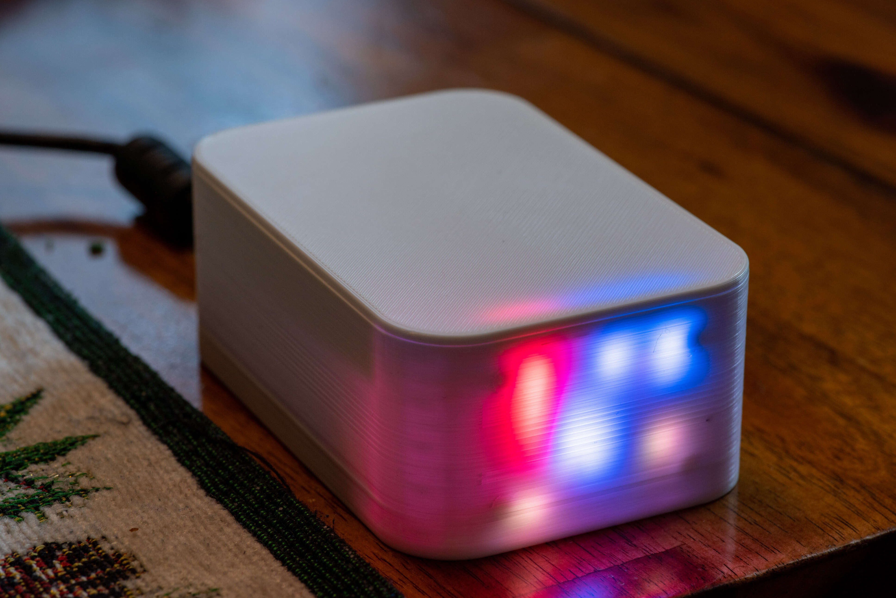
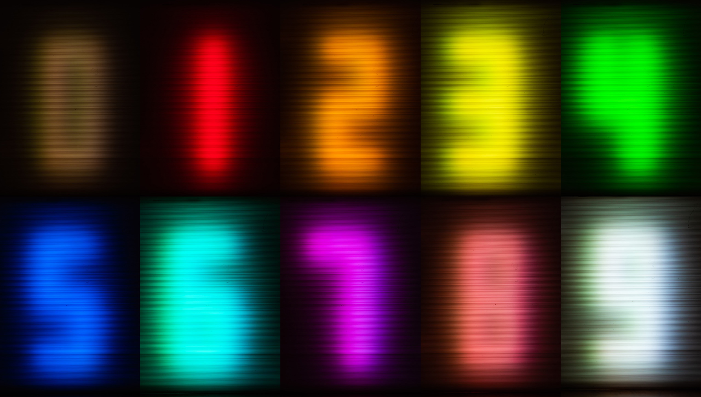
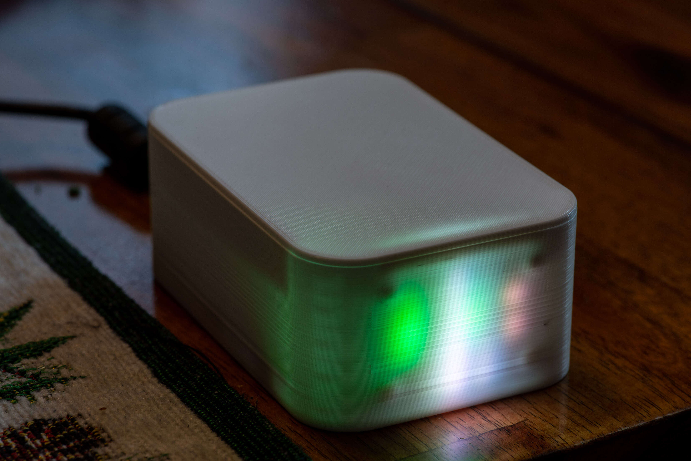
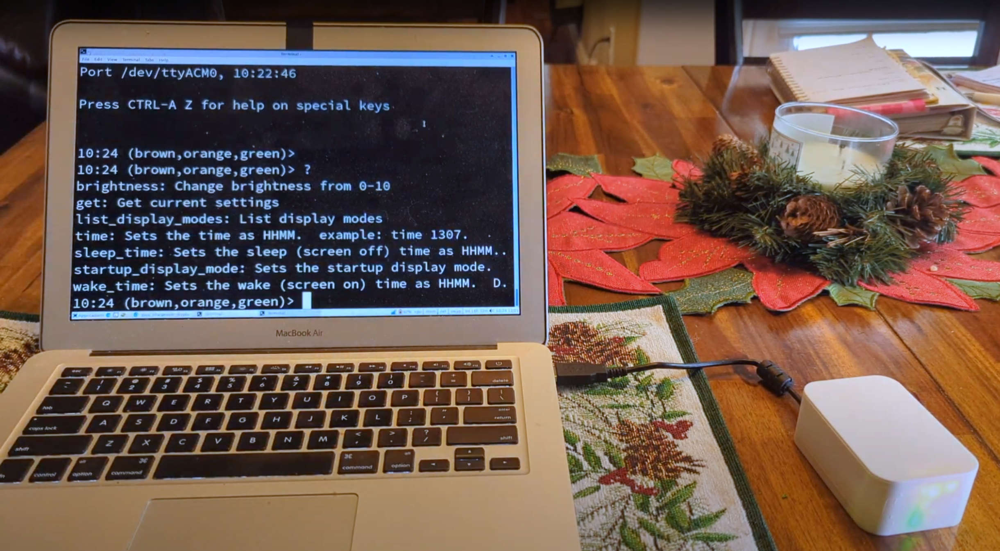
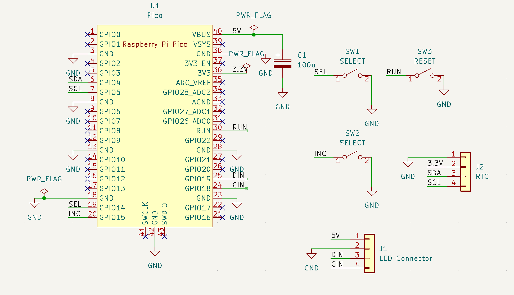
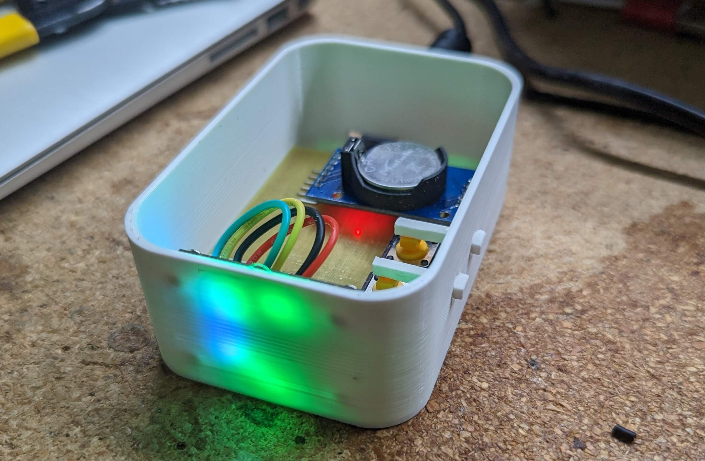
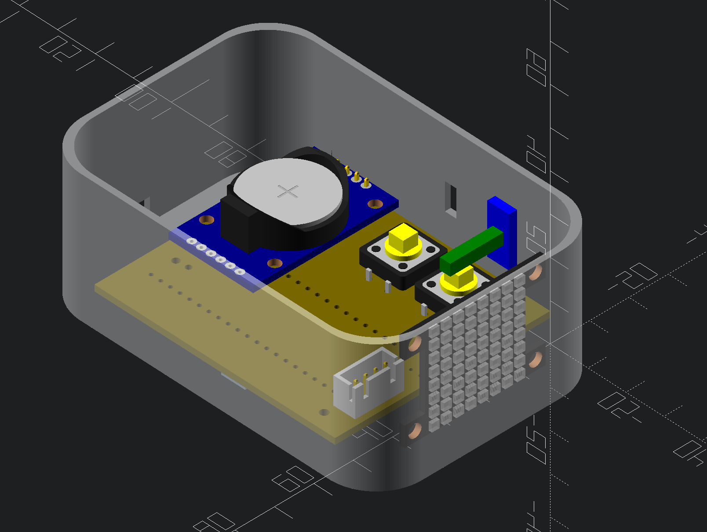
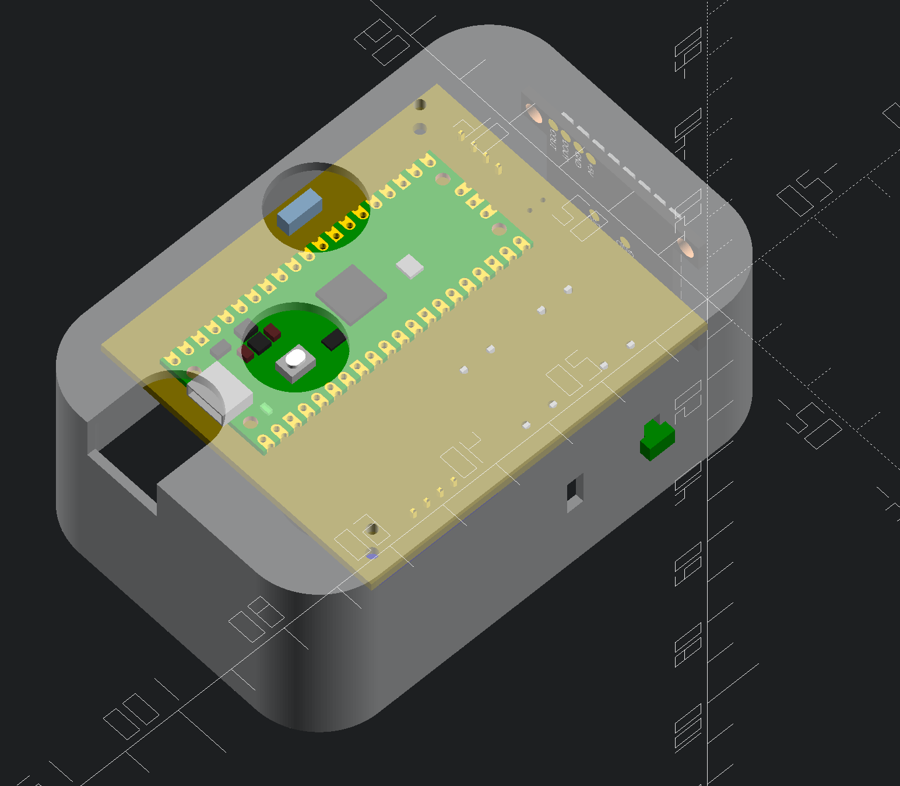

# matrix_clock
> "I DON’T EVEN SEE THE CODE ANYMORE" - The Matrix.  



Shown above is a clock that presents the current time on an 8x8 RGB LED matrix.  It's not readable to a passer-by but one can learn to read it with practice.

Here I explain how to build the clock above.  I also explain how to modify the design in different ways.

# Parts List

Here are the parts I used to build the pictured version.  You can of course modify the design to use different ones:

   * Microcontroller: [Raspberry PI Pico ($4)](https://www.adafruit.com/product/4864)
   * LED Matrix: [Adafruit Dotstar 8x8 ($25)](https://www.adafruit.com/product/3444)
   * Clock: [DS3231-based RTC module ($4)](https://www.amazon.com/HiLetgo-AT24C32-Arduino-Without-Battery/dp/B00LX3V7F0)
   * Buttons: [2 12x12 pushbuttons for control (<$1)](https://www.amazon.com/WOWOONE-12x12x7-3-Tactile-Momentary-Assortment/dp/B08JLWTQ3C), 1 6x3 SMD reset button (optional)
   * Connector: 1 4x1 JST-XR male-female pair for connecting the LED matrix
   * 1 220uF capacitor to reduce 5V noise
   * PCB for assembly (however you want to build it.  maybe something like [this](https://www.amazon.com/DEYUE-Double-sided-Prototyping-Solder-able-Protoboards/dp/B07FFDFLZ3))

# Reading the clock

Here is my scheme for showing the time, which you can easily modify to your preference.

Numbers are represented by colors.  At the time of writing, they are as follows:




> Colors are defined in [src/colors.c](src/colors.c) if you would like to edit them.

As for the individual digits in the time, these are represented by the speed at
which the matrix points fall:

| digit               | speed  |
|---------------------|--------|
| Hour - ones place   | slow   |
| Minute - tens place | medium |
| Minute - ones place | fast   |

Here are some examples:

| 12h time | 24h time | Slow point | Medium Point | Fast Point |
|----------|----------|------------|--------------|------------|
| 12:00 AM | 00:00    | brown      | brown        | brown      |
| 12:15 AM | 00:15    | brown      | red          | blue       |
| 1:37 PM  | 13:37    | yellow     | yellow       | magenta    |
| 11:37 PM | 23:37    | yellow     | yellow       | magenta    |


If you are wondering about the hour's tens place, the clock doesn't show it.  I thought it made the clock easier to read but you'll have
to be aware of the time-of-day enough to determine in the tens place yourself.

> Note that the clock has other easier-to-read modes that show actual numbers,  More on that later.

# Feature Overview

This is a quick tour of the built in-features

## Power On

When you plug in the clock via any USB power source you will get a matrix clock display that indicates the current time as-reported by the internal clock module.



## Setting the Time

The clock has two buttons on it's side: "set" and "increment".

   * If you press the *set* button once, the clock will show the current hours as numbers.  You can use the *increment* button to change the hour.
   * If you press the *set* button again, the clock will show the current minutes.  You can use the *increment* button to change the minute.
   * If you press the *set* button a third time, the clock will return to showing the matrix display

> You can also set the clock via the USB connection.

## Changing the Display Mode

If you press the "increment" button while the matrix is showing, the clock will
cycle through display modes.  Currently defined modes include:

* **Matrix -** The default
* **Time scroll -**, similar to matrix mode but uses numbers so it's easier to read
* **Time fade -**.  Uses bigger numbers so even easier to read
* **Binary digits -**  Uses binary symbols in place of digits. Unfortunately my plastic case diffuses the pixels too much for this mode to work well for me, but it would work better with alternate case designs.
* **Off -**  Useful if you want a darkened room.

## Console Configuration

If you plug the clock into a computer, you can run a terminal emulator program to access additional settings.  In Linux, I use the "minicom" terminal emulator and my command looks like this:

```bash
minicom -b 115200 -P /dev/ttyUSB0
```

> The serial device (`/dev/ttyUSB0`) can vary between computers and operating systems. 

Once started, you will see something like this:



By default, `minicom` turns on local echo, making my typed characters appear twice.
`minicom` allows this to be turned off with `ctrl-a e`.

Type `help` or `?` for help.  Basic options include:

   * Changing LED brightness
   * Changing the time
   * Setting a sleep/wake time where the clock LEDs will automatically turn off.

# Build Instructions

## Electronics

Here is the schematic:



In terms of an electronic project, the schematic is simple.

Outside of the obvious parts (LED Matrix, PI Pico, RTC, buttons, connectors), there
is a single capacitor.  This capacitor exists to help out the 5V power supply
connected to the clock.  Basically the LED matrix can be a very "noisy load"
drawing almost zero current one instant and quite a bit more the next (depending
on how many LEDs are lit).  The presents a challenge to the 5V regulator.  It
can also lead to voltage spikes due to natural induction properties in the power
wires.  Since the exact properties of the voltage regulator and connection wires
are unknown and variable, it's hard to say how much capacitance (if any) is
needed but adding some capacitance wont hurt anything and could resolve issues
(like random resets) in otherwise-marginal cases.  The size you choose for the
capacitor is up to you but bigger is a bit better you want to to play it extra
safe.



Talking a bit more about the schematic:

The PI Pico connects to the RTC (Real time clock) with a
[I2C](https://en.wikipedia.org/wiki/I%C2%B2C) connection.  There is a bit of a
tripping point here.  Most RTC modules ask for 5V but the Pico is 3.3V.  If you
provide 5V to the RTC, pullup resistors that are almost always included on the
RTC PCB will pull the SDA and SCL lines to 5V which the Pico does not support.
One solution is to remove these pullup resistors and provide your own pullup
resistors to 3.3V instead.  In my case (and likely yours too) an even easier
solution is avaiable.  I simply power the RTC with 3.3V instead of 5V and it
still works fine.

I'm using a Dotstar 8x8 LED matrix.  This matrix uses a protocol that is
compatible with [SPI](https://en.wikipedia.org/wiki/Serial_Peripheral_Interface)
and thus we use the Pico SPI hardware to do the communications.  Alternatives
LED matrix hardware includes [Neopixel](https://www.adafruit.com/product/1487)
and the ["city sign" 16-pin protocol](https://www.adafruit.com/product/420).  If
you want to go with one of these, you'll need to adjust the hardware connections
accordingly - getting them working as an isolated demo is something I would
consider a prerequisite.

There are three buttons.  One is an optional "Reset" button.  If the RUN *pin*
is pulled to ground, the chip is reset.  This is mostly useful for loading new
firmware.  You press reset while holding down the BOOTSEL button on the pico and
it will be ready to accept new firmware.  Without a reset button, you can still
load firmwre but will need to hold BOOTSEL on plugin.

The other buttons are "set" and "increment" as-described in an earlier section.  These utilize the Pico's built in pullup resistor option to implement a button.  Press the button and the signal will be pull down from 3.3V (due to the internal pullup) to 0V and the press will be detected by the hardware/firmware.

## Firmware

> TLDR: If you don't want to build the firmware (`matrix_clock.uf2`) yourself, I
have a precompiled version under the [firmware](firmware) directory.

Source files (written in C) are  provided in the [src/](src) directory.  If you have never built PI Pico firmware before, run through the official [Getting started with the Raspberry Pi PICO](https://datasheets.raspberrypi.com/pico/getting-started-with-pico.pdf) documentation first to get the needed tools up-and-running on your system.

The instructions for building the clock firmware are the same as the guide
linked above, but I created a small/simple [bootstrap.sh](src/bootstrap.sh)
script to lessen the number to needed steps:

```bash
./bootstrap.sh 
cd build/
make -j
```

I encourage you to view the contents of [bootstrap.sh](src/bootstrap.sh) yourself instead of blindly running it.  You'll see something like this:

```bash
$ cat bootstrap.sh 
#!/bin/bash

if [ ! -f pico_uart_console/CMakeLists.txt ]; then
  git submodule init
  git submodule update
fi

rm -rf build
mkdir build
cd build
cmake ..
```

The two major things done here are getting some dependencies (submodules) and setting up a new build environment under `build/`

If all went well above, you will have a `build/matrix_clock.uf2` file available to load onto a PI Pico.

# 3D Printed Case

The 3D printed case is available at [case/matrix_clock_case.scad](case/matrix_clock_case.scad)



Looking at the underside, we can see the PICO.  There are also some access ports for the BOOTSEL and reset buttons (for convienent firmware reloading):



If you don't want to mess around with OpenSCAD, you can look at the [case/3mf](case/3mf) directory for files you can load directly into your slicer program.  The same directory also has the file [3mf/prusa_slicer_project.3mf](3mf/prosa_slicer_project.3mf) which can be loaded into Prusa slicer if you happen to use that software.

If you do want to dig into OpenSCAD, I'll point to these lines specifically:

```openscad
  button_peg_shaft();
  button_peg_backing();
  ...
  *top_cover();
  clock_base();
```

These represent the major printable parts.  You can place a `*` in front of a part to hide it or a `!` in front of it to show it in isolation.

A few of other notes about the design:

* The spacing between the LED matrix and front wall leads to a fairly diffused display.  This looks fine in the "matrix" mode but blurry when displaying numbers.  If you want to more readable numbers, you may want to inset a grid into the front to help guide the light.  Keep in mind that the LED matrix does produce some heat while it is running.
* I intentionally set the matrix spacing to allow for some light to leak into the rest of the case.  I like the resulting effect but you could mask off the light paths if you would prefer the back of the case remain dark.
* I would consider the button design "ok" but not "great".  I'd suggest rethinking the design if you plan to use the buttons often.  The current design uses the backing plate for leverage (blue in the image above).  The fit is intentionally tight and might require some light sanding to get it on.  After you get the feel correct, you fix the backing into place with a touch of CA glue.

# Cusomization Guide

This part of the documentation points you in the right direction if you want to modify the project.

## Using Different LED Hardware

The file [src/led_matrix.h](src/led_matrix.h), contains the interface your
hardware driver will be called with.
[src/led_matrix_dotstar.c](src/led_matrix_dotstar.c) implements it for the 8x8
dotstar case.  To use your own, create a new `.c` file (such as
`src/led_matrix_neopixel.c` and change `CMakeLists.txt` to point to your new
file instead of `led_matrix_dotstar.c`.  The main function you'll be
implementing is:

```c
#define LED_MATRIX_WIDTH 8
#define LED_MATRIX_HEIGHT 8

// render the matrix.
// data is of the form 0xIIRRGGBB where
// II -> Intensity (brightness)
// RR -> Red
// GG -> Green
// BB -> Blue
//
// Values are 0-255
// format is horizontal rows.  The first pixel
// sent is the southwest corner of the matrix.
void led_matrix_render(uint32_t* data);
```

again, look at [src/led_matrix_dotstar.c](src/led_matrix_dotstar.c) for a concrete exmaple of an implementation of `led_matrix_render`.  It's really not much code for the dotstar case.

## Using Different Clock Hardware

Instead of an RTC, you might want to go with a radio-based clock, a GPS clock, or [keeping the time with the Pi Pico](https://raspberrypi.github.io/pico-sdk-doxygen/group__hardware__rtc.html) (requiring the user to set the time whenever the power is removed).

[src/clock.h](src/clock.h) gives the interface:

```c
// gets the current time in HHMM format (0000 - 2359)
// For example, if 1354 is returned, the time is 13:54 (or
// 1:34 PM if you prefer)
uint16_t clock_get_time();

// Sets the time.  For example: time_hhmm = 1234 would set the
// time to 12:34.  Note that 24h time is always used so 1234
// is 12:34 PM and 0034 is 12:34 AM.
void clock_set_time(uint16_t time_hhmm);
```

and [src/clock.c](src/clock.c) gives a concrete implementation for the RTC module.

## Changing The Display Rendering

There are two files and one directory to consider.  The first file is [src/clock_render.c](src/clock_render.c).  Specifically, this section:

```c
struct DisplayMode display_modes[] = {
  {"normal", matrix_render},  // This entry will be the default power-on mode
  {"number_cascade", number_cascade_render},
  {"number_fade", fade_render},
  {"binary_grid", binary_grid_render},
  {"off", blank_render},  // always put this entry at the end of the list
};
```

This section lists the display modes, names them and provides a function pointer to each one.  If you were to remove a line from this array, or reorder the lines, you would see the corresponding change when you build/load new firmware.  In order for the function pointers to have any meaning, you'll need to include the corresponding files:

```c
#include "render/blank.h"
#include "render/fade.h"
#include "render/matrix.h"
#include "render/number_cascade.h"
#include "render/number_grid.h"
```

Note that, by convention, all rendering functions are defined in the [src/render](src/render) directory.  Here is an example [src/render/blank.c](src/render/blank.c):

```c
void blank_render(
    uint32_t* led,
    uint32_t frame_index,
    uint16_t time_hhmm,
    const struct ClockSettings* settings) {
  memset(
    led,
    0,
    LED_MATRIX_WIDTH * LED_MATRIX_HEIGHT * sizeof(uint32_t));
}
```

This simple function simply clears the `led` array to zero which effectively turns off the display.

Showing actual patterns will generally require use of the other parameters, such as `time_hhmm`.

The `frame_index` parameter can be useful for initilization.  It is always set to `0` when the display mode is made active.

The `settings` structure has several potentially-useful fields but especially useful is getting the user preference for LED brightness:

```c
  const uint8_t br = brightness_step_to_brightness(settings);
```

This value (0-255), would then be used as a baseline brightness when turning on leds in `led`

## Changing the Console

The file `src/clock_settings.c` contains all of the commands available to the
USB shell.  Adding your own is straight-forward but I suggest skimming through
https://github.com/mattwach/pico_uart_console to get up-to-speed on how the
console works first.

## Using a Different Microcontroller

The hardware requirements for the microcontroller are not demanding for this project (as implemented anyway).  Going with AVR, ESP, STM, PIC or something else would all work perfectly fine.  The main difficulty will be adapting the firmware, specifically:

* The CMake build system
* Access to the PI Pico SDK

To work around these, I would suggest copying the source files to a new project folder, use the "default" build system for your microcontroller and addressing the compiler errors one by one.  Remember that since PI Picos are only $4 and are readily available (at the time I write this) the motivation for going through this effort might not be immediately obivous to others.

